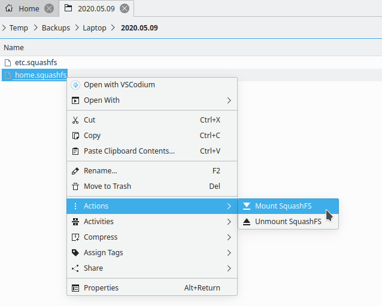
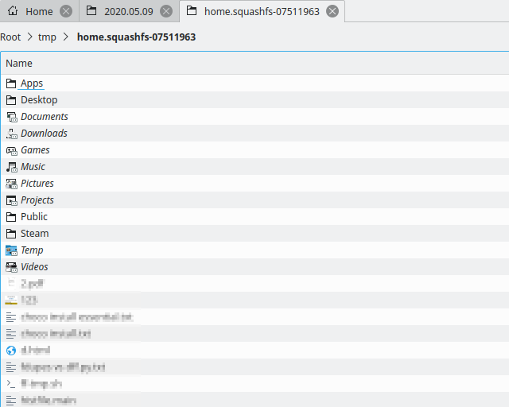

## Dolphin service menu: SquashFS mounter / unmounter

- Mount SquashFS file using "Mount SquashFS". No root required.
  - After mounting it opens created mount point in your file manager.  
    It creates a mount point in `/tmp` using the name of the file being mounted + first 8 characters of file path's `sha256` hash.
- Unmount previously mounted file using "Unmount SquashFS".

**Supported languages:** Dutch, English, Russian  

Adding support for your language is very simple:

Just add `Name[xx]=…` translated entries for it in `.desktop` file and create a pull request :wink:  
To do so in GitHub web interface, you can edit file right there, then click `Propose changes` → `Create pull request`.

### Installation
Place `.desktop` file in `~/.local/share/kio/servicemenus`

---

This project uses `squashfuse`. Please, make sure `squashfuse` package is installed.

### Screenshots

